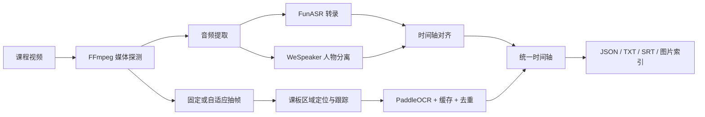

# Course Video Analyzer

[](https://github.com/WenzhengLi/VideoCaptioner/actions/workflows/ci.yml)
[](https://www.python.org/)
[](LICENSE)

一个本地优先的课程视频分析工具：在同一时间轴中输出“谁在什么时候说了什么”，以及
“当时课件、黑板或共享屏幕显示了什么”。核心识别流程由 Python 包完成，不依赖 LLM。

当前默认策略是 `complete-v1`：固定 5 秒覆盖抽帧，优先保证短暂课板内容的完整度。
自适应区间拆分、OCR 缓存和区域裁剪作为可选加速能力保留。

## 能做什么

- 使用 FunASR 生成带时间戳的中文语音转录。
- 使用 WeSpeaker 区分说话人，并支持人工映射为“导师”“学员”等名称。
- 自动定位左侧、右侧或全屏课板区域，跟踪页面变化并选择清晰代表帧。
- 使用 PaddleOCR 提取课板文字，保留原始图片、OCR JSON 和可修订文本。
- 将语音、说话人和课板合并到统一时间轴，导出 JSON、TXT、SRT 和课板索引。
- 任务阶段可恢复；大体积帧和 OCR 元数据可落盘缓存，不要求全部常驻内存。
- 提供 Gradio 本地网页，适合没有 AI 人工介入的日常批处理。
- 提供 P01–P06 课程知识流水线：完整规范化、来源分类、案例边界、证据提取、安全审查和
  Tidy 兼容原子知识条目。
- 提供独立的“阿峰方法层”：从 P04/P05 证据字段生成课程方法，经过忠实度审查和发布分类后
  输出可追溯 Markdown；该分支不消费旧 P06，也不执行课程安全评价。
- 将 WeSpeaker 的 `Speaker N` 声纹簇原样保留为 `speaker_N`，避免身份未知时丢失说话人区分。

## 架构



流水线按 `media → transcript → diarization → alignment → board_detect → board_track →
board_ocr → merge → export` 执行。每个阶段记录状态和产物，失败后可以从已完成阶段恢复。

## 快速开始

要求 Python 3.11。推荐使用 [uv](https://docs.astral.sh/uv/) 管理环境。

```powershell
git clone https://github.com/WenzhengLi/VideoCaptioner.git
cd VideoCaptioner

python -m pip install uv
uv sync --extra web --extra audio --extra vision --group dev
uv run course-video-web
```

默认打开地址：<http://127.0.0.1:7860>。

外部运行依赖：

- FFmpeg / FFprobe：媒体探测、音频提取和固定抽帧。
- Python 3.11：当前锁定的音频和 OCR 依赖以此版本为基准。
- CUDA 可选；CPU 可以运行，但长视频完整 OCR 会耗时较久。

环境排查：

```powershell
uv run python scripts/verify_runtime.py
```

## 处理模式

| Profile | 抽帧方式 | 适用场景 |
| --- | --- | --- |
| `complete-v1` | 固定 5 秒，最多 800 帧 | 默认；完整度优先，尽量保留短暂课板 |
| `adaptive-complete` | 自适应区间拆分 | 希望减少 OCR，同时保守识别页面变化 |
| `adaptive-balanced` | 自适应区间拆分 | 更重视速度，可接受较少的短暂内容 |

新任务可以通过 Web 页面选择 Profile。程序化调用可传入：

```python
config = {
    "processing_profile": "complete-v1",
    "interval_ms": 5_000,
    "max_frames": 800,
}
```

旧的 `adaptive_sampling` 与 `adaptive_ocr_*` 配置仍然兼容。完整参数见
[处理 Profile](docs/processing-profiles.md) 和 [自适应 OCR 调度](docs/adaptive-sampling.md)。

## 任务与输出

运行数据默认写入 `jobs/<job-id>/`，该目录不会提交到 Git：

```text
jobs/<job-id>/
├─ job.json                         # 阶段状态、配置、错误和产物索引
├─ media.json                       # 视频时长、分辨率、帧率和音视频流
├─ audio/audio.wav                  # 标准化音频
├─ frames/manifest.json             # 抽帧时间、模式和统计
└─ artifacts/
   ├─ analysis.json                 # 完整结构化分析结果
   ├─ timeline.json                 # 统一时间轴
   ├─ transcript.txt                # 人类可读语音 + 课板文本
   ├─ transcript.srt                # 语音字幕
   ├─ audio/                        # 转录、人物分离、对齐结果
   └─ boards/                       # 代表帧、OCR 结果和课板索引
```

图片、SQLite 缓存、模型、真实视频和导出文件都由 `.gitignore` 排除，避免仓库被运行数据污染。

实验脚本默认在最终 TXT 或 benchmark JSON 校验成功后删除帧、OCR 图片和跟踪目录，只保留
轻量最终结果。调试算法时可传 `--keep-artifacts` 显式保留中间产物。正常 Web 任务的
`jobs/` 不会自动删除，以保证任务恢复和下载功能。

## 项目结构

```text
src/course_video_analyzer/
├─ audio/       # FunASR、WeSpeaker、CAM++ 与时间轴对齐
├─ media/       # FFmpeg 探测、音频提取、固定抽帧
├─ vision/      # 课板检测、跟踪、自适应拆分、OCR 和磁盘缓存
├─ timeline/    # 语音与课板合并
├─ exporters/   # JSON、TXT、SRT 和课板索引
├─ jobs/        # 可恢复任务工作区
├─ web/         # Gradio UI 与后台任务服务
├─ models.py    # 公共数据契约
├─ processing_profiles.py
└─ pipeline.py  # 顶层阶段编排

tests/          # 单元、管线、Web 和可选集成测试
benchmarks/     # 评估代码；真实结果目录不入库
scripts/        # 环境验证和视觉算法复跑工具
docs/           # 架构、配置、评估与设计记录
```

## 课程知识库流水线

知识数据默认写入 `data/`，不提交 Git，也不覆盖历史版本：

```text
01_raw -> P01 规范化 -> P02 来源/知识属性 -> P03 案例边界
       -> P04 单案例证据提取 -> P05 证据与安全审查
       -> P06 原子条目 + Markdown -> SQLite FTS 检索
```

Cursor 阶段通过独立任务清单调用，固定使用 headless 全权限参数：
`-p --force --sandbox disabled --approve-mcps --trust --model auto`。每课、每案例使用独立上下文；
程序负责完整性校验、证据范围校验、缓存、重试和断点续跑。P02 使用紧凑复核包，Cursor 只返回
判断决策，再由确定性代码应用到全量 segments，避免大 JSON 导致长时间阻塞。

分批迭代时必须传入独立 `WaveId`（例如 `C006-C010`）。P01–P06 和最终验收会写入带波次名的
状态、失败与完成标记，避免新一批误用上一批的完成文件。守护脚本可以提前启动：前置产物未完成时
只轮询等待，完成后自动继续，不会向桌面会话请求 Cursor 权限。

常用命令：

```powershell
python -m course_video_analyzer.knowledge.cli index-tidy `
  --data-root data --database data/tidy/knowledge.db

python -m course_video_analyzer.knowledge.cli search-tidy "明确拒绝" `
  --database data/tidy/knowledge.db --limit 8

python -m course_video_analyzer.knowledge.cli answer-context "聊天问题" `
  data/tidy/query-context.json --database data/tidy/knowledge.db
```

完整目录、Prompt 迭代和批次规则见 [知识库流水线](docs/knowledge-pipeline.md)。

新的阿峰方法分支为：

```text
P04/P05 evidence fields -> 方法提炼 -> 忠实度审查 -> 发布分类 -> Markdown -> Dify
```

其中 Markdown 由程序确定性渲染，主要判断、步骤和表达必须引用当前案例 segment ID。实现、
CLI 和硬性发布闸门见 [阿峰方法层 v001](docs/afeng-method-layer.md)。

## 开发与质量检查

```powershell
uv sync --extra web --extra audio --extra vision --group dev
uv run ruff check .
uv run pyright
uv run pytest -q -m "not integration"
```

需要真实模型、FFmpeg 或网络的测试带有 `integration` 标记，可单独执行：

```powershell
uv run pytest -q -m integration
```

提交规范与开发流程见 [CONTRIBUTING.md](CONTRIBUTING.md)。

## 设计原则

- 完整度优先：不能用重复出现次数代替内容完整度。
- OCR 调度与抽帧解耦：允许多抽帧做图片比较，但避免重复 OCR 同一帧。
- 本地优先：原始视频、音频、图片和 OCR 缓存默认不离开本机。
- 可恢复：每个阶段有明确输入、输出和持久化状态。
- 可替换：ASR、人物分离、OCR、帧仓库和导出器均通过清晰接口解耦。
- 可追溯：知识条目必须引用原始 segment ID，并区分观察、讲师观点、引用和模型推断。
- 尊重边界：明确拒绝、不适和撤回同意是停止信号，不会被转换成默认的“测试”或推进技巧。

## 文档

- [总体方案](docs/00-总体方案.md)
- [处理 Profile](docs/processing-profiles.md)
- [自适应区间拆帧与 OCR 调度](docs/adaptive-sampling.md)
- [内容区域与磁盘缓存](docs/region-disk-iteration.md)
- [Web 使用说明](docs/web.md)
- [开发环境](docs/environment.md)
- [评估方法](docs/evaluation.md)
- [阿峰方法层 v001](docs/afeng-method-layer.md)

## 来源与许可证

本仓库沿用 [WEIFENG2333/VideoCaptioner](https://github.com/WEIFENG2333/VideoCaptioner)
的 Git 历史和 GPL-3.0 许可证；当前代码已重构为课程视频的说话人分离与课板 OCR 分析工具。
详见 [LICENSE](LICENSE)。
